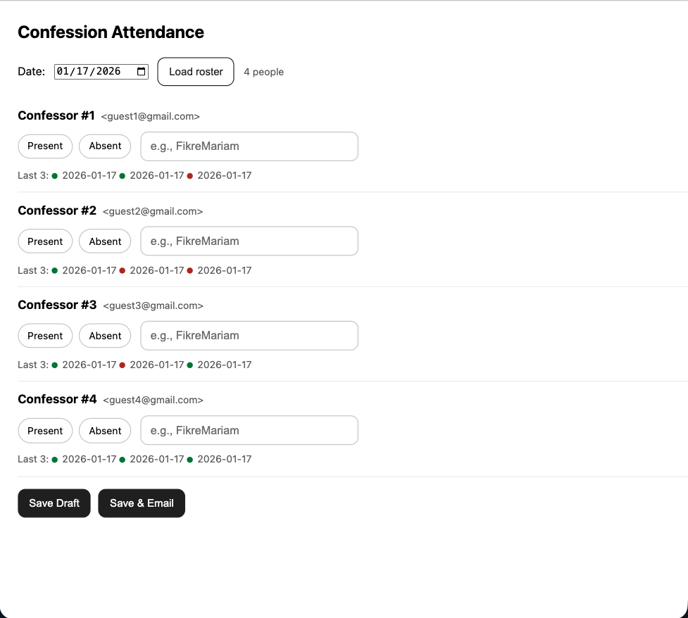

# Confession Attendance Management System

A mobile-first attendance management web app built with **Google Apps Script** and a **React-based frontend**, designed to streamline weekly scheduling and attendance tracking for large recurring events.

The system is actively used to manage attendance for **250+ participants** and integrates directly with **Google Calendar**, **Google Sheets**, and **Gmail**.

---

## ✨ Features

- 📅 **Automatic roster generation** from Google Calendar events
- 🧠 **Draft-based workflow** allowing partial saves without committing data
- ✅ **Validation logic** to prevent incomplete submissions
- ✉️ **Automated email summaries** based on attendance status
- 📱 **Mobile-first responsive UI** optimized for touch devices
- 🔁 **Stateful React UI** embedded inside Google Apps Script HTML service

---

## 🏗️ Architecture

**Frontend**
- React (UMD) rendered inside Apps Script HTML
- Fully responsive layout with touch-optimized controls
- Real-time UI state management (attendance + draft persistence)

**Backend**
- Google Apps Script (V8 runtime)
- Google Calendar API (roster generation)
- Google Sheets (attendance + draft storage)
- Gmail service (conditional email notifications)

All configuration (calendar IDs, recipient emails, feature flags) is injected at runtime via a private Google Sheet and is **not included in this repository**.

---

## 🔒 Privacy & Security

This repository contains **application logic only**.

- No real user data is included
- No Google Sheet IDs, Calendar IDs, or emails are hardcoded
- All sensitive values are loaded dynamically from a private configuration sheet at runtime
- Test functions and logs are disabled or clearly marked to prevent accidental use

---

## 🧪 Local Development Notes

This project is designed to run inside a **Google Apps Script** environment.

To use:
1. Create a new Apps Script project
2. Copy backend files into the script editor
3. Add the frontend HTML file via **HTML Service**
4. Configure a private Google Sheet for settings and storage
5. Deploy as a web app (restricted access)

---

## 📸 Screenshots

| Desktop |
|-------|
|  |

---

## 🚀 Why This Project

This project demonstrates:
- Real-world full-stack development
- Integration with third-party APIs
- State management without a traditional backend server
- Thoughtful UX for non-technical users
- Privacy-aware design in a production environment

---

## 🧑‍💻 Author

Built and maintained by **[Your Name]**  
